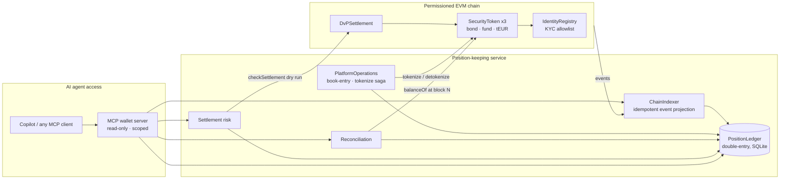

# Tokenized Position Keeping

A working prototype of **position keeping for tokenized securities** with an **AI-agent wallet service**:

- **Permissioned security tokens** (simplified ERC-3643): KYC allowlist, freeze, pause, pre-trade compliance check.
- **Atomic delivery-versus-payment (DvP)** settlement that records failed attempts on-chain with reason codes.
- A **double-entry position ledger** that covers **tokenized, book-entry and hybrid** instruments, including
  tokenization and detokenization between the book-entry register and the chain.
- **Reconciliation** of the ledger against the chain that tells *timing* breaks apart from *genuine* breaks, and checks
  supply and 1:1 backing.
- **Settlement-risk detection** for pending instructions, with shortfall sizing and suggested fixes.
- A read-only, account-scoped **MCP server** so AI agents (e.g. GitHub Copilot in VS Code) can query real-time positions.

All instruments, parties and ISINs in the demo are fictional.



## Run it

Requires Node.js 22.5 or later (it uses the built-in `node:sqlite`).

```powershell
npm install
npm run compile
npm test                 # 16 tests: contracts + end-to-end service

# terminal 1: local chain
npm run chain

# terminal 2: scripted scenario, then an agent-style MCP session
npm run demo
npm run mcp:smoke
```

**With GitHub Copilot:** open this folder in VS Code. [.vscode/mcp.json](.vscode/mcp.json) registers the
`tokenized-wallet` server, scoped to `fund-a` and `fund-b`. Then, in agent mode, try:

- *"What does fund-a hold, and how much of it is on-chain versus book-entry?"*
- *"Which of fund-a's settlements are at risk today, and what should we do about them?"*
- *"Reconcile positions. Is anything out of line?"*
- *"Show bank-c's positions."* → denied, because bank-c is outside the agent's scope.

`npm run demo` resets `data/ledger.db`. Stop the MCP server first, because it keeps the database open.

## What the demo walks through

| Step | What happens | What it shows |
| --- | --- | --- |
| Book-entry issuance | 10,000 ACME-2030 bonds are issued into fund-a's register account | Positions that exist only off-chain |
| Tokenize | 4,000 units are locked in the token vault, then minted to fund-a's wallet | Hybrid instrument, lock-then-mint saga |
| DvP #1 | fund-a delivers 1,000 bonds to fund-b against 101,200.00 tEUR | Atomic settlement, no principal risk |
| DvP #2 | bank-c owes 253,000.00 tEUR but holds 250,000.00 | Settlement fail recorded on-chain, nothing moves |
| DvP #3 | Buyer has not affirmed and the deadline is 30 minutes away | High-risk flag before the fail happens |
| Compliance check | Transfer to a non-KYC wallet | `RECIPIENT_NOT_VERIFIED` before anything is sent |
| Detokenize | fund-b burns 500 tokens; the vault releases 500 book-entry units | Hybrid backing stays 1:1 |
| Timing break | A direct on-chain transfer before the ledger syncs | Classified as `TIMING`, clears on the next sync |

## Design decisions

- **Double-entry ledger.** Every journal entry must net to zero per location (`ONCHAIN`, `BOOK`), so positions can
  never appear from nothing. System accounts represent issuance, on-chain supply and the token vault.
- **Hybrid backing as an invariant.** For hybrid instruments, units in `SYS:TOKEN_VAULT` must equal on-chain
  `totalSupply`. Reconciliation checks this, and the indexer flags any mint without a matching book-entry lock
  (`UNBACKED_MINT`).
- **Tokenize as a saga.** The book-entry lock is written before the mint. If the mint fails, a compensating unlock is
  recorded, so a unit can never count as both held in the register and tokenized.
- **Point-in-time reconciliation.** Each balance is read at the block the ledger is synced to *and* at the chain head.
  A difference at the synced block is a genuine break; a difference only at the head is unindexed activity.
- **Fails are data, not reverts.** `settle()` returns `false` and emits `SettlementFailed(reason)` instead of reverting,
  so operations teams and agents can see *why* something failed. `checkSettlement()` is a free dry run.
- **Agents read, they never move assets.** The MCP server has no write tools, every tool is annotated `readOnlyHint`,
  access is scoped per account (`TPK_ALLOWED_ACCOUNTS`), and counterparty holdings are not disclosed to agents outside
  the counterparty's scope. Every response carries `asOfBlock` and `asOfTime`, so answers can be checked.
- **Real-time by construction.** Each MCP call syncs the indexer to the chain head first. Syncs are serialized and
  idempotent (keyed by transaction hash and log index), so concurrent agent calls are safe.

## Deliberate simplifications

This is a prototype. A production system would also need:

- **Finality and reorgs.** The indexer assumes immediate finality, which holds on permissioned BFT chains (e.g.
  Hyperledger Besu with QBFT) but not on public chains.
- **Key management.** Issuer and agent keys should sit in an HSM or MPC custody service, not in a local signer.
- **Full ERC-3643.** Real deployments add ONCHAINID claims, modular compliance rules (country limits, investor caps)
  and forced transfers for corporate actions and recovery.
- **Operational scale.** Move from SQLite to a managed relational store, with the indexer as a separate worker.
- **Cash leg.** The tEUR token stands in for tokenized commercial-bank money or a wholesale settlement asset.

### How this maps onto Google Cloud

| Prototype component | Google Cloud option |
| --- | --- |
| Local Hardhat node | Blockchain Node Engine, or a Besu network on GKE |
| SQLite ledger | Cloud SQL for PostgreSQL / AlloyDB |
| Indexer loop | Cloud Run job or GKE worker, with Pub/Sub to fan out events |
| Position analytics | BigQuery (ledger export or CDC via Datastream) |
| MCP wallet server | Cloud Run service behind IAM; Vertex AI agents as clients |
| Issuer keys | Cloud KMS / Cloud HSM |

## Project layout

```
contracts/             IdentityRegistry, SecurityToken, DvPSettlement
src/ledger/ledger.ts   double-entry position ledger (SQLite)
src/indexer.ts         chain event → ledger projection
src/operations.ts      book-entry and tokenize/detokenize operations
src/reconciliation.ts  ledger vs chain reconciliation
src/settlementRisk.ts  pending-instruction risk assessment
src/mcp/server.ts      MCP wallet server for AI agents
scripts/demo.ts        end-to-end scenario
scripts/mcp-smoke.ts   MCP client that exercises the server
test/                  contract and service tests
```

## License

MIT
